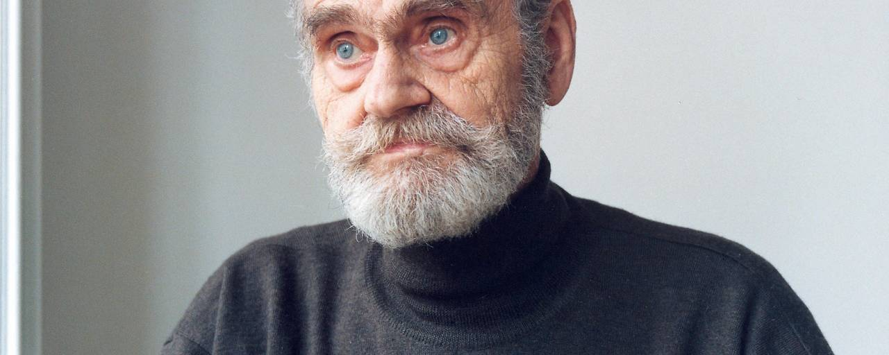

# H.C. Artmann — Biographie & Werke
## Handout

{width=150px}

---

## Kurzbiografie

**Hans Carl Artmann** (12. Juni 1921 Wien–Breitensee — 4. Dezember 2000, Wien)

Ein österreichischer Dichter, Übersetzer und Sprachkünstler, der die deutschsprachige Literatur des 20. Jahrhunderts durch experimentelle Spracharbeit, Dialektdichtung und avantgardistische Formen nachhaltig geprägt hat.

### Zitat
> „ich trage keine socken beim dichten, denn dichten ist ein barfüßiger vorgang."

---

## Lebensabschnitte

### Kindheit & Jugend (1921)
- Geboren in **Wien-Breitensee, Kienmayergasse 43**
- Sohn des Schuhmachers Johann Artmann und Marie (geb. Schneider)
- Aufwachs in einem Handwerkerviertel mit frühem Kontakt zu Fremdsprachen (besonders Tschechisch)
- Nach dem Hauptschulabschluss als Büropraktikant tätig
- Frühe Faszination für Sprache und Dialekt

### Krieg & Verwundung (1940–1945)
- 1940: Eingezogen zur Deutschen Wehrmacht
- 1941: Schwere Kriegsverletzung an der Ostfront, Versetzung in Strafbataillon
- 1945: Kriegsgefangenschaft durch amerikanische Truppen
- **Nach Kriegsende:** Arbeit als Übersetzer für alliierte Truppen (Zeichen außergewöhnlicher Sprachbegabung)

### Literarische Anfänge (1947–1952)
- 1947: Erste Lyrikveröffentlichung im Radio Wien
- Entdeckung von Dadaismus, japanischer Haiku-Dichtung und mittelalterlichen Balladen
- 1951: Eintritt in den **Art-Club** (wichtigste Künstlervereinigung Nachkriegs-Wiens)
- Ab 1952: Enge Zusammenarbeit mit Gerhard Rühm und Konrad Bayer

### Die Wiener Gruppe (1953–1958)
- Um 1953: Gründung der legendären **Wiener Gruppe**
- **Mitglieder:** Friedrich Achleitner, Konrad Bayer, Gerhard Rühm, Oswald Wiener
- Radikale Experimente mit Sprache, Form und Performance
- 1958: Artmann verlässt die Gruppe im Jahr seines größten Erfolgs

### Der Durchbruch: *med ana schwoazzn dintn* (1958)
- Veröffentlichung des berühmtesten Werks: *med ana schwoazzn dintn. gedichta r aus bradnsee*
- **Sammlung:** Gedichte im **Wiener Dialekt** — löst eine **Dialektwelle** in der deutschsprachigen Literatur aus
- Verbindung von schwarzem Humor und makabren Szenen aus dem Wiener Vorstadtleben
- Satirische Provokation, enthusiastisch aufgenommen von Lesern

### Europäische Wanderjahre (1960–1972)
- Ab 1954: Reisen nach Frankreich, Spanien und **Irland**
- Irland wird lebenslange Faszination — beschrieben als „Feenland, regenbogenartig, magisch"
- Keltische Mythen fließen in sein Werk ein
- **Später:** Übersetzung keltischer Klosterdichtung (*Schlüssel zum Paradies*, 1993)
- Ab 1960: Dauerhafter Verlassen Wiens
  - Schweden (1961–1965)
  - Berlin (1965–1969)
  - 1972: Umzug nach Salzburg
- Übersetzungen von Villon, Molière, Lope de Vega

### Fernsehen & Film
Artmann schrieb auch für Film und Fernsehen — zwischen Wiener Volkstheater und Avantgarde:

- **Das Donauweibchen** (1960)
  - Regie: Wolfgang Glück, Musik: Paul Angerer
  - „Wiener Fernsehdramolett" mit Gerhard Rühm
  - Rockerballade im Wiener Untergrund der späten 1950er
  - 43 Min., Schwarzweiß

- **Die Moritat vom Räuberhauptmann Johann Georg Grasel** (1969)
  - Regie: Otto A. Eder, Drehbuch: Artmann & Friedrich Polakovics
  - ORF-Produktion über niederösterreichischen Räuberhauptmann
  - Typisch Artmann'scher Moritatenstil

### Auszeichnungen & Ehrungen (1974–1997)
- **1974:** Großer Österreichischer Staatspreis für Literatur
- **1977:** Literaturpreis der Stadt Wien
- **1991:** Ehrendoktorat der Universität Salzburg
- **1997:** Georg-Büchner-Preis (höchste Auszeichnung im deutschsprachigen Raum)
- **1997:** Ehrenpreis des österreichischen Buchhandels für Toleranz

### Rückkehr & Vermächtnis (1995–2000)
- 1995: Rückkehr nach Wien
- Lehrtätigkeit an der Wiener Schule für Dichtung
- Weiteres Schreiben und Dichten bis ins hohe Alter
- **4. Dezember 2000:** Tod in Wien durch Herzinfarkt
- **Beisetzung:** Wiener Zentralfriedhof

---

## Gesamtwerk — Werke (Auswahl)

### Lyrik & Gedichte
- **med ana schwoazzn dintn** (1958) — Wiener Dialektgedichte
- **Von denen Husaren und anderen Seil-Tänzern** (1959)
- **Das suchen nach dem gestrigen tag** (1964)
- **Gedichte über die Liebe und über die Lasterhaftigkeit** (1975)

### Prosa & Experimental
- **dracula dracula** (1966) — Parodie auf den Vampirmythos
- **Frankenstein in Sussex** (1969) — Groteske Prosa
- **The Best of H. C. Artmann** (1970) — Werkauswahl

### Besonderheiten
- Meisterschaft in zahlreichen Sprachen
- Übersetzungen aus: Schwedisch, Spanisch, Englisch, Französisch, Dänisch
- Theaterstücke, Hörspiele, experimentelle Textformen

---

## Digitale Ressourcen

### Gedichte & Audio-Aufnahmen
- **lyrikline.org:** [H.C. Artmann — Gedichte mit Audioaufnahmen](https://www.lyrikline.org/en/authors/h-c-artmann)
  - Audio-Player mit allen verfügbaren Aufnahmen
  - Gedichte: Blauboad 1, Noch ana Sindflud, Sintflut u.v.m.
  - Österreichischer Rundfunk, 1996

### Weitere Informationen
- **Wikipedia:** [H.C. Artmann — Ausführliche Biografie](https://de.wikipedia.org/wiki/H._C._Artmann)
- **Wikipedia:** [med ana schwoazzn dintn](https://de.wikipedia.org/wiki/Med_ana_schwoazzn_dintn)
- **Wiener Gruppe:** [Legendäre Avantgarde-Bewegung der Nachkriegszeit](https://de.wikipedia.org/wiki/Wiener_Gruppe)

### Street View — Geburtshaus
- **Kienmayergasse 43, Wien-Breitensee**
- Google Maps Street View: [Zum Geburtshaus](https://www.google.com/maps/@48.2023379,16.3104053,3a,75y,185.81h,106.26t)

---

## Charakteristika & Bedeutung

### Sprachliche Innovation
Artmann war ein Meister der **Sprachvielalt**:
- Hochsprache und Dialekt
- Experimentelle Textformen
- Internationale literarische Traditionslinien (Dadaismus, japanische Poesie, keltische Mythen)
- Humor, Absurdität und tiefe Emotionalität

### Die Wiener Gruppe
Eine der **bedeutendsten literarischen Avantgarde-Bewegungen der Nachkriegszeit**:
- Radikale Experimente mit Sprache und Form
- Verbindung von Performance und Text
- Bruch mit etablierten literarischen Konventionen
- Bleibende Einfluss auf deutschsprachige Literatur

### Vermächtnis
H.C. Artmann hinterlässt ein Werk von **unvergleichlicher Vielfalt**:
- Ein Kosmos aus Dialekt und Hochsprache
- Humor und Abgrund
- Tradition und radikaler Erneuerung
- Ein Zeugnis der Kraft der Sprache

---

## Literaturliste zum Weiterlesen

1. Artmann, H.C. *med ana schwoazzn dintn* (1958)
2. Artmann, H.C. *Das suchen nach dem gestrigen tag* (1964)
3. Artmann, H.C. *Schlüssel zum Paradies* (1993) — Übersetzungen keltischer Klosterdichtung
4. Achleitner, F. / Bayer, K. / Rühm, G. / Wiener, O. (Hg.) *Die Wiener Gruppe* — Anthologie
5. Kostka, A. *H.C. Artmann: Der Dichter und sein Werk* (Literaturwissenschaftliche Analyse)

---

**Quellen:** H.C. Artmann Biographie Slideshow • lyrikline.org • Wikipedia • Google Maps Street View

*Handout erstellt: März 2026*